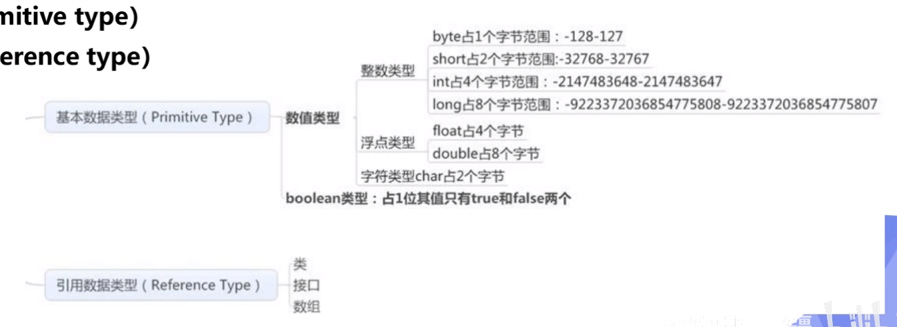
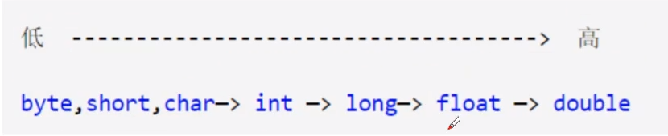
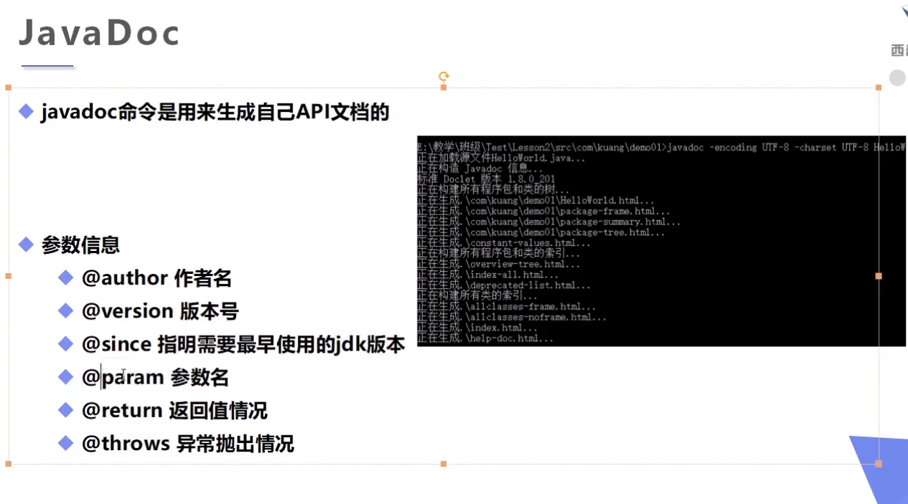

# Elementary

## 注释（Comments）

Java的注释有三种：

- 单行注释
- 多行注释
- 文档注释

*BAT*指的是百度阿里腾讯

可以去网上搜“有趣的代码注释”，获得很有意思的知识图案。

可以使用中文当作标识符。

## 数据类型

- Java是强类型语言：变量的使用严格符合规定（Java，C++）：比如必须先定义后使用，不经过强制类型转换就只能是某一个类型，字符串之间不能进行数字的加减等等。——安全性高，速度慢
- 弱类型语言：可以不严格符合使用规定（JavaScript，VBscript）——速度快一点，安全性不太高。e.g. “12” + 3 -> "123"或者123。在Java里面这两种情况是分开的。
- Java数据类型分为两大类：基本类型(Primitive type)和引用类型(reference type)。

需要额外注意的是：

- long而不是long long
- boolean只占1 bit
- 浮点数里面用的最多的是double
- byte相对于C来说像char，而char有两个字节

## 数据类型转换

- 强制类型转换，高->低，必须要made explict
- 自动类型转换，低->高，不需要made explicit

注意：

- 不能对布尔类型的值进行转换---只有一个bit
- 不能把对象类型转换为不相干的类型

## 变量类型

- 局部变量 (local variable)
- 实例变量 (instance variable)
- 类变量 (class variable)

## 变量命名规范

- 类成员变量和局部变量以及属性：首字母小写加驼峰原则：monthSalary
- 常量：全大写加下划线
- 类名：首字母大写加驼峰原则
- 方法名：首字母小写加驼峰原则：runMethod()

## 运算符

- 关系运算符中有一个特殊的运算符instanceof
- 条件运算符：? :
- 扩展运算符：+=，-=，*=，/=
- 位运算符>>>是无符号右移，~是取反
- 自增运算符++，自减运算符--，都是一元运算符，与C里完全一样

## 包机制

- 说白了就是文件夹

- 一般利用公司域名倒置作为包名：www.baidu.com 则包名为com.baidu.www
- 在特定文件夹中的java程序开头第一行必须是package
- import在package后面，一旦import Elementary.Elementary1，则Elementary1这个类可以直接使用而不需要拖着前缀名字。
- import *（正则表达式通配符），导入所有类

## JavaDoc

