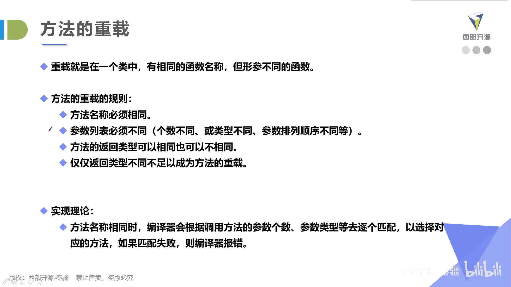
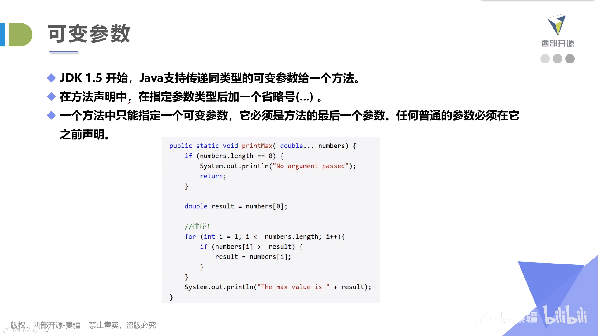

# 方法

- 方法的原子性：一个方法只完成一个功能，这样有利于后期的扩展
- 方法的命名：首字母大写的驼峰原则

## 定义

- 方法名和参数列表共同构成方法签名
- 参数列表是指方法的参数类型、顺序和参数的个数

## 重载

## 可变参数

- 本质是个变长数组

## 递归

- 递归头：最开始的特殊判断部分

比如if(n == 1)return 0;

- 递归体：其他部分
- 能不用递归就不用了，用其他方法代替