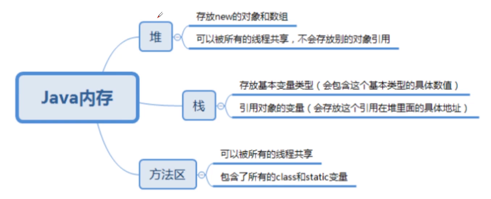
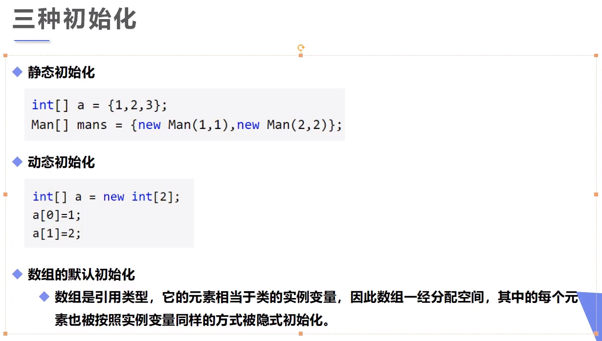
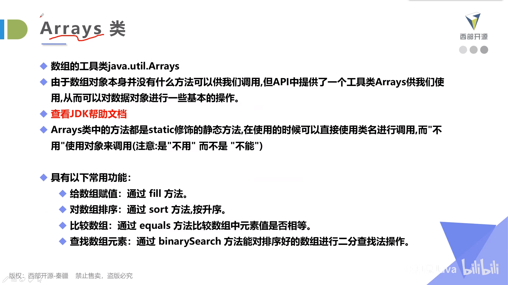
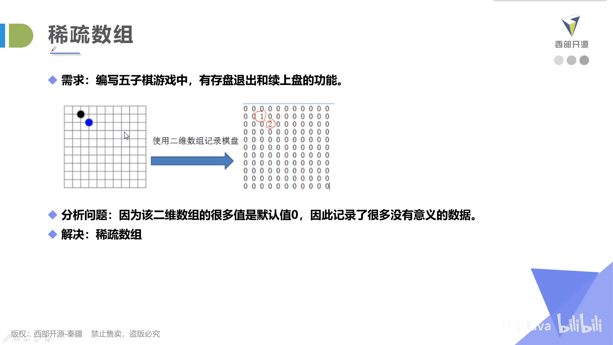
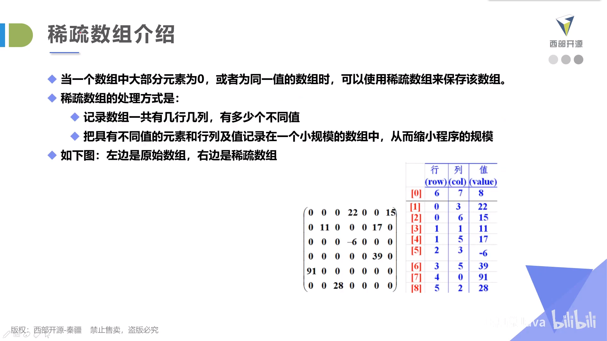

# 数组

## Java内存

- 声明的时候，数组并不存在。只有创建的时候才会在堆区中开辟空间。一旦发生越界，Java会抛出异常。

## 数组初始化

## 数组特点

- 数组已经创建，长度就不可改变，要改变的话，一定会重新创建一段完全不同的空间。
- 数组其实是一个对象，是一个类的实例，因为数组还有a.length这种成员变量。

## Arrays类

## 稀疏数组 --- 一种数据结构

